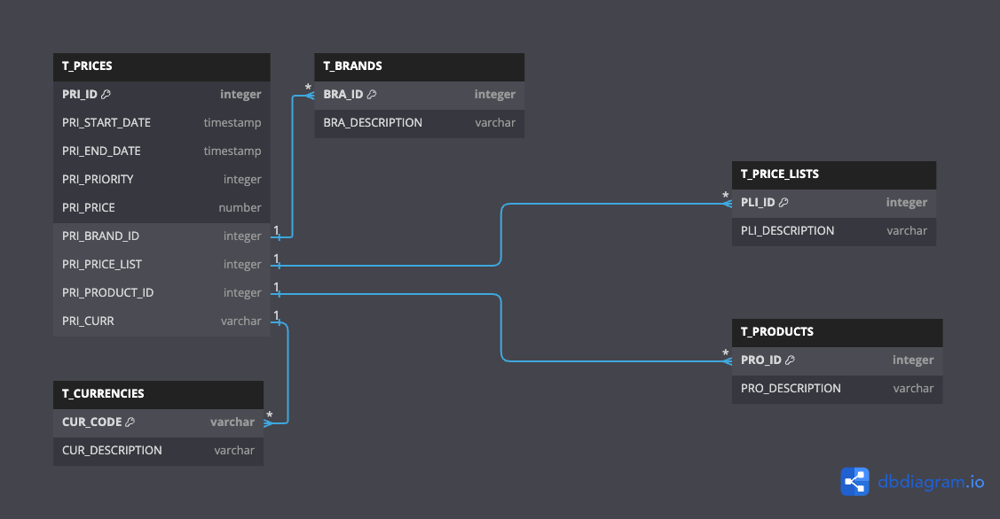
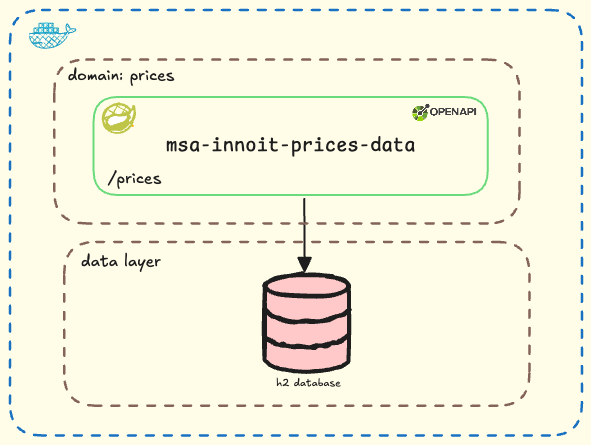
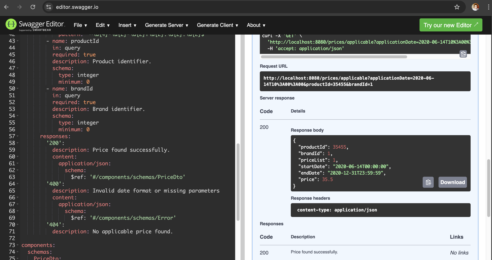
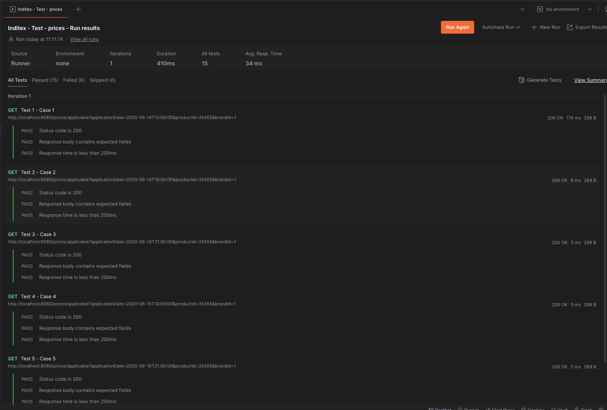

# Inditex Challenge InnoIt

This project is a solution to the Inditex Challenge for the InnoIt program. The challenge consists of developing a REST API to query the price of a product at a given time for a specific brand and price list.


## Problem Statement

This Spring Boot application provides a REST endpoint to query the price of a product at a given time for a specific brand and price list. The data is stored in an in-memory H2 database, initialized with sample data for testing purposes.

## Features
- REST endpoint to fetch the price of a product based on:
    - Date of request
    - Product ID
    - Brand ID (e.g., ZARA)
- Uses an in-memory H2 database to store price details.
- Supports price query with respect to valid date ranges and priority.

## Table Schema

The application uses a table called `PRICES` with the following columns:

| Column        | Type         | Description                                               |
|---------------|--------------|-----------------------------------------------------------|
| `BRAND_ID`    | Integer      | Foreign key for the brand (e.g., 1 = ZARA)                |
| `START_DATE`  | DateTime     | Start date and time when the price is valid               |
| `END_DATE`    | DateTime     | End date and time when the price is valid                 |
| `PRICE_LIST`  | Integer      | Price list identifier                                      |
| `PRODUCT_ID`  | Integer      | Product identifier (e.g., 35455)                           |
| `PRIORITY`    | Integer      | Price priority for resolving conflicts                     |
| `PRICE`       | Decimal      | Final price for the product                               |
| `CURR`        | String       | Currency ISO code (e.g., EUR)                             |

### Example Data

| BRAND_ID | START_DATE             | END_DATE               | PRICE_LIST | PRODUCT_ID | PRIORITY | PRICE  | CURR |
|----------|------------------------|------------------------|------------|------------|----------|--------|------|
| 1        | 2020-06-14T00:00:00    | 2020-12-31T23:59:59    | 1          | 35455      | 0        | 35.50  | EUR  |
| 1        | 2020-06-14T15:00:00    | 2020-06-14T18:30:00    | 2          | 35455      | 1        | 25.45  | EUR  |
| 1        | 2020-06-15T00:00:00    | 2020-06-15T11:00:00    | 3          | 35455      | 1        | 30.50  | EUR  |
| 1        | 2020-06-15T16:00:00    | 2020-12-31T23:59:59    | 4          | 35455      | 1        | 38.95  | EUR  |

## How to Run

To run the application, execute the following command:

```bash
gradle clean
gradle build
docker build -t prices-data .
docker run -p 8080:8080 prices-data
```


## Solution

or this project we propose a solution that takes into consideration from a scalable database to an internal project containing a robust and technology-independent architecture.

### Database

The database is an in-memory H2 database that is initialized with sample data for testing purposes. The database schema is defined in the `schema.sql` file, and the sample data is loaded from the `data.sql` file.
We normalize our database to the third normal form, to avoid data redundancy and ensure data integrity, however, it is understood that only the prices table will be used.



### Architecture

We implemented an architecture based on microservices and using DDD for the division of our project, although the implementation is not visible at first glance because it is only a service, as it scales this will make more sense.



Additionally, we implemented the use of hexagonal architecture for the separation of layers and the implementation of unit tests.


### API First Design

The architecture follows the **API First Design** principle. Each microservice defines its API contracts using OpenAPI. This approach enables the design and validation of APIs before writing code, ensuring that teams can develop and consume services with clear specifications.



### Tests 

For this project we performed different tests which are:

- Unit tests
- Integration tests
- Functional tests
- Regression tests (postman file)

These tests allow us to guarantee the correct performance of our project as well as the expected results.

## Deployment

For this case we use docker as a deployment tool, for this the following command must be executed:

```bash
gradle build
docker build -t prices-data .
docker run -p 8080:8080 prices-data
```
## Flow working
We used `git flow` for the development of this project, so the following branches were created:
- master
- dev
- feature/feature-name

Additionally we simulated pair-review for code review and pull request approval.

With this we should have our application running on port 8080.

## Evidence


## Author
Bryam David Vega Moreno <br>
Sr Java Developer